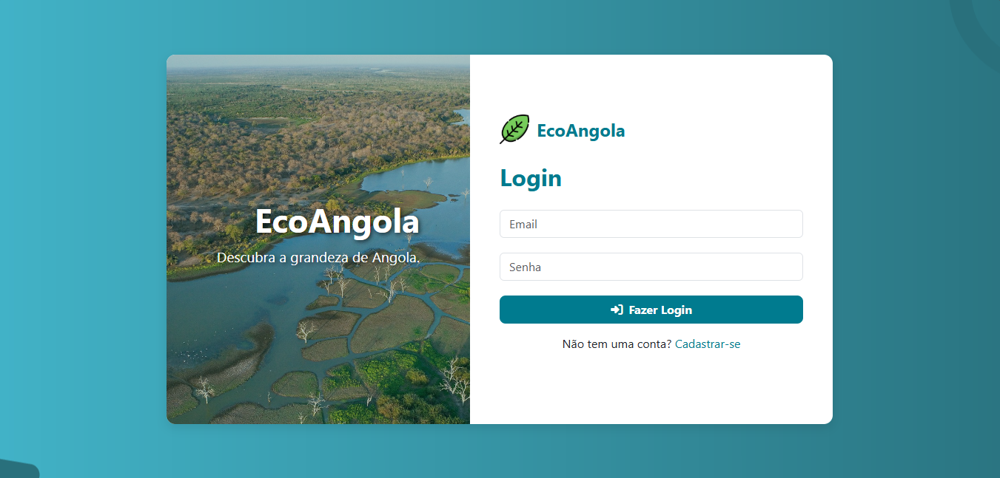

# FTL---AO-BOOTCAMP-HACKATHON
First of all, you must download the file geoBoundaries-AGO-ADM1.geojson from the URL (https://github.com/wmgeolab/geoBoundaries/raw/9469f09/releaseData/gbOpen/AGO/ADM1/geoBoundaries-AGO-ADM1.geojson
) and then move it to the data/ directory.

Estrutura dos Services

Os services são responsáveis por implementar a lógica de negócio da aplicação.
Eles acessam a base de dados (SQLite) através da classe Entity e retornam dados estruturados que podem ser usados tanto no CLI quanto em futuras APIs ou interfaces gráficas.

🔹 1. criar_roteiros(user_id: int) -> bool

Entrada: ID do usuário logado, ID do ponto turístico, data da visita.

Processo:

Valida login (se user_id não existe, aborta).

Pede ID do ponto turístico e data de visita (YYYY-MM-DD).

Valida formato da data.

Cria e salva um objeto RoadMap no banco de dados.

Saída: True (sucesso) ou False (falha).

Uso: Criar roteiros personalizados para cada usuário.

🔹 2. destinos_mais_avaliados(limit: int = 5) -> list[dict]

Entrada: limite de resultados (default = 5).

Processo:

Consulta pontos_turisticos + avaliacoes.

Calcula a média das notas (AVG).

Ordena por maior média.

Saída: Lista de dicionários, ex.:

[{"nome": "Parque Kissama", "media": 4.8}, ...]

Uso: Mostrar ranking dos pontos turísticos mais bem avaliados.

🔹 3. pontos_turisticos_por_provincias() -> list[dict]

Entrada: nenhuma.

Processo:

Consulta pontos_turisticos.

Agrupa por provincia e conta quantos pontos existem em cada uma.

Saída: Lista de dicionários, ex.:

[{"provincia": "Luanda", "total": 12}, {"provincia": "Huíla", "total": 8}]

Uso: Estatísticas de distribuição dos pontos turísticos em Angola.
